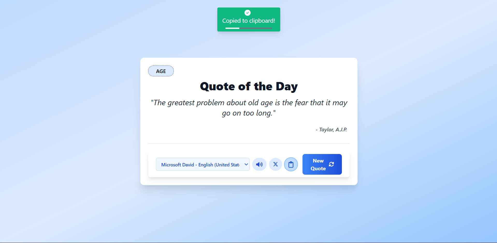

# ✨ Beautiful Quote Generator

A modern, responsive quote generator built with HTML, Tailwind CSS, and JavaScript. Instantly fetches inspiring quotes from a public API, lets you listen to them in any available voice, copy to clipboard with a progress bar, and share directly to Twitter—all in a beautiful, glassy blue UI, smooth interactions, voice playback, social sharing, and more.



[](LICENSE)
[](https://developer.mozilla.org/en-US/docs/Web/HTML)
[](https://developer.mozilla.org/en-US/docs/Web/CSS)
[](https://developer.mozilla.org/en-US/docs/Web/JavaScript)
[](https://tailwindcss.com/)

[](https://fontawesome.com/)
[](https://git-scm.com/)
[](https://github.com/)
[](https://github.com/)

---

## ✨ Features

- **📜 Random Quotes**: Instantly fetches a new quote and author from the API
- **🏷️ Category Ribbon**: Prominently displays the quote's category
- **🔊 Voice Playback**: Listen to quotes in different voices (selectable)
- **📤 Social Sharing**: Share quotes directly to Twitter
- **📋 Copy to Clipboard**: Copy the quote and author with one click
- **🎨 Modern UI**: Elegant, blue-gradient UI with smooth transitions and responsive design
- **📱 Fully Responsive**: Works beautifully on desktop, tablet, and mobile
- **⚡ Fast & Lightweight**: No frameworks or build tools required—just open and use!
- **🕘 Loading & Error Handling**: Friendly loading and error messages

---

## 🎮 Usage Guide

### Basic Controls

- **New Quote:** Click the "New Quote" button to fetch a new random quote.
- **Listen:** Click the speaker icon to hear the quote in your selected voice/language.
- **Change Voice:** Use the dropdown to pick a different voice/language; audio will switch instantly if playing.
- **Copy:** Click the clipboard icon to copy the quote and author. A popup with a progress bar will confirm success.
- **Share:** Click the Twitter icon to open a tweet composer with the quote pre-filled.

### Error Handling
- If the API fails, a friendly error message will appear
- Voice playback is disabled if not supported by your browser

---

## 🔧 Tech Stack

- **HTML5**: Semantic markup
- **Tailwind CSS**: Utility-first CSS framework via CDN
- **JavaScript ES6+**: Async/await, DOM manipulation, fetch API
- **Font Awesome**: Icon library via CDN
- **API Ninjas Quotes API**: Real-time quotes and categories
- **Git** – Version control
- **GitHub** – Code hosting and collaboration

---

## 🛠️ Getting Started

1. **Clone the repository:**
   ```bash
   git clone https://github.com/pvm-harshavardhan/quote-generator.git
   ```
2. **Change to the project directory:**
   ```bash
   cd quote-generator
   ```
3. **Update the API key:**
   - Open `app.js` and replace the placeholder API key with your own from [API Ninjas](https://api-ninjas.com/profile).
4. **Open the app:**
   - Open `index.html` in your web browser.

5. **Start generating quotes!** ✨

_No build step or server required!_

---

## 📁 Project Structure

```
quote-generator/
├── 📄 index.html     # Main HTML file with Tailwind & Font Awesome CDN
├── ⚡ app.js         # JavaScript logic for quotes, UI, and audio
```

---

## 🔑 API Configuration

The app uses the **API Ninjas Quotes API** for real-time quote data:

- **API Key**: Configured in `app.js` near the top
- **Base URL**: `https://api.api-ninjas.com/v1/quotes`
- **Rate Limits**: See [API Ninjas documentation](https://api-ninjas.com/api/quotes) for current limits
- **Free Tier**: Available for basic usage

**🔄 Want to use a different quote API provider?**  
You can easily switch to another API by updating the endpoint and API key in `app.js`.  
Just make sure the new API returns a quote and author in its response, and adjust the code if the response format is different.

---

## 📱 Browser Compatibility

- ✅ Chrome (recommended)
- ✅ Firefox
- ✅ Safari
- ✅ Edge
- ⚠️ Internet Explorer (limited support)

---

## 🐛 Troubleshooting

### **Quotes Not Loading?**
1. Check your internet connection
2. Ensure the API key is valid and not rate-limited
3. Check browser console for errors
4. Verify file paths in the code

### **Audio/Voice Issues?**
1. Some browsers/devices may not support all voices
2. Try refreshing the page or selecting a different voice

### **Styling Issues?**
1. Make sure Tailwind CSS and Font Awesome CDNs are accessible
2. Clear browser cache

---

## 🖼️ Customization & Screenshots

- Update colors and styles in Tailwind classes in `index.html`
- Add more social sharing options in `app.js` if needed

---

## 🤝 Contributing

Contributions are welcome!  
Feel free to open issues or submit pull requests to improve the app.

---

## 📄 License

This project is licensed under the **MIT License** - see the [LICENSE](LICENSE) file for details.

## 📞 Contact

Your Name - [@pvm_harsha](https://x.com/pvm_harsha)   
Project Link: [Quote Generator Web Project](https://github.com/pvm-harshavardhan/quote-generator)

---

**Made with ❤️ by P VM Harsha Vardhan**